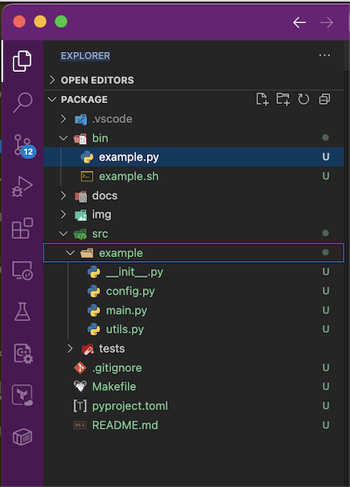

# Example

An example of a Python layout installable program.

## Markdown reference

Github Markdown is [here](https://docs.github.com/en/get-started/writing-on-github/getting-started-with-writing-and-formatting-on-github/basic-writing-and-formatting-syntax#links).

### Image

Layout is below. 

